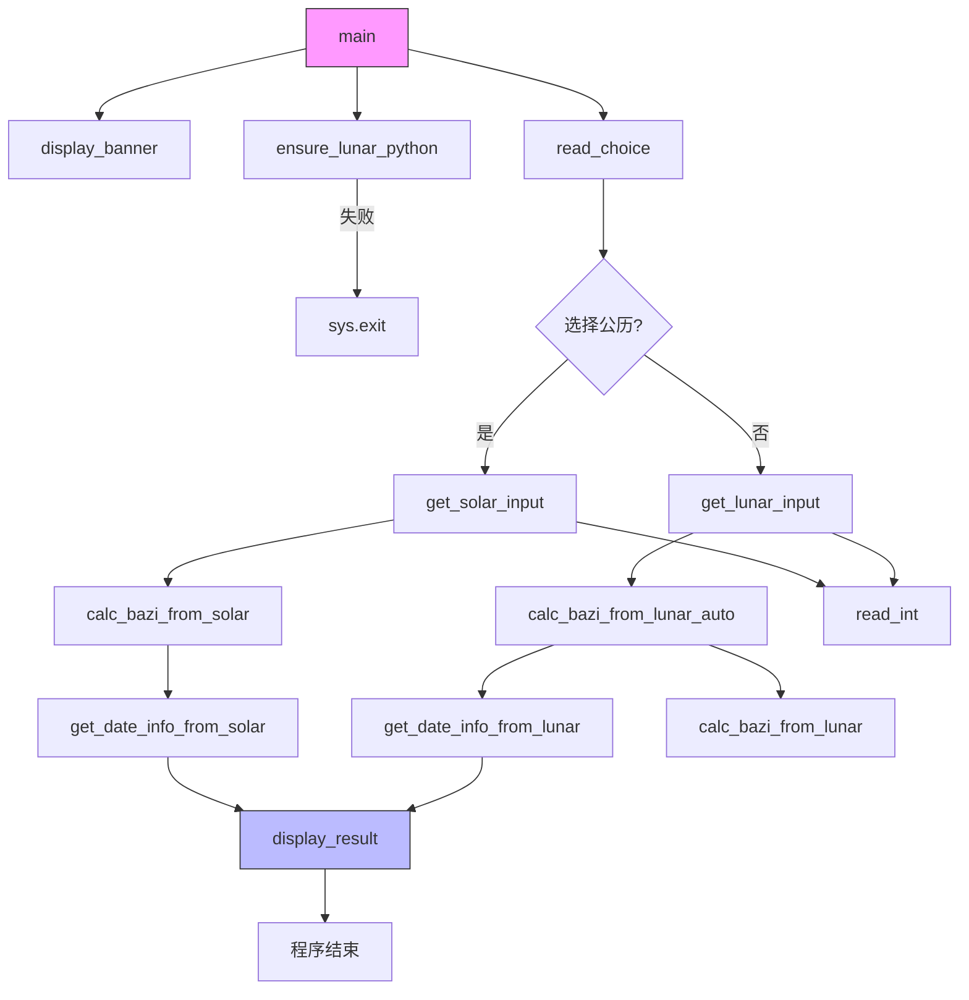

<cite>
**Referenced Files in This Document**   
- [2.py](file://2.py)
</cite>

## 目录
1. [代码结构](#代码结构)
2. [主要函数职责](#主要函数职责)
3. [函数调用关系](#函数调用关系)
4. [代码可读性与可维护性](#代码可读性与可维护性)
5. [未来优化建议](#未来优化建议)

## 代码结构

该 `2.py` 文件实现了完整的四柱八字计算器功能，采用单文件结构组织代码。代码通过清晰的函数划分实现了功能模块化，每个函数都有明确的职责和良好的文档说明。整个程序从 `main` 函数开始执行，通过一系列函数调用来完成用户输入、数据验证、八字计算和结果展示的完整流程。

**Section sources**
- [2.py](file://2.py#L1-L488)

## 主要函数职责

### ensure_lunar_python（依赖检查）
该函数负责检查 `lunar-python` 库是否已正确安装。通过尝试导入库中的 `Solar` 和 `Lunar` 类来验证依赖的可用性。如果检测到库未安装，函数会向用户输出清晰的安装指引，包括标准安装命令和 PowerShell 环境下的安装命令，确保用户能够顺利解决依赖问题。

**Section sources**
- [2.py](file://2.py#L12-L29)

### read_int（安全读取整数）
该函数提供了一个健壮的整数输入读取机制。它不仅处理基本的输入读取，还包含了完整的输入验证逻辑，包括空输入检查、数值范围验证和类型转换异常处理。函数支持可选的最小值和最大值参数，实现了灵活的数值约束。同时，函数还处理了用户中断（Ctrl+C）的情况，确保程序能够优雅退出。

**Section sources**
- [2.py](file://2.py#L32-L67)

### read_choice（选项选择）
该函数用于处理用户的选择输入，将输入统一转换为小写进行比较，提高了输入的容错性。函数会持续提示用户直到获得有效选项，确保了程序流程的稳定性。通过将选项列表转换为小写形式进行匹配，函数实现了不区分大小写的选项验证。

**Section sources**
- [2.py](file://2.py#L70-L96)

### get_solar_input / get_lunar_input（输入获取）
这两个函数分别负责公历和农历输入的获取。它们通过调用 `read_int` 函数来安全地读取年、月、日、时四个维度的数据，并设置了合理的数值范围限制。函数结构清晰，每个输入都有明确的提示信息，提升了用户体验。

**Section sources**
- [2.py](file://2.py#L219-L236)

### calc_bazi_from_solar / calc_bazi_from_lunar（核心计算）
这两个函数是八字计算的核心，分别处理公历和农历输入的转换计算。`calc_bazi_from_solar` 函数将公历日期转换为农历，然后提取四柱信息；`calc_bazi_from_lunar` 函数则直接处理农历输入。两个函数都包含了完善的错误处理机制，当输入日期无效时会抛出带有详细信息的 `ValueError` 异常。

**Section sources**
- [2.py](file://2.py#L99-L156)

### calc_bazi_from_lunar_auto（自动闰月处理）
该函数在 `calc_bazi_from_lunar` 的基础上增加了自动闰月判断功能。它首先尝试获取当年的闰月信息，如果无法获取（兼容旧版本库），则通过异常处理机制进行降级处理。函数实现了智能的闰月判断逻辑：优先尝试非闰月，若日期不存在则自动尝试闰月，大大简化了用户的操作。

**Section sources**
- [2.py](file://2.py#L159-L203)

### display_result（结果展示）
该函数负责格式化并展示计算结果。它以清晰的分隔线和标题组织输出内容，分别显示公历时间、农历时间和四柱八字信息。输出格式美观，信息层次分明，便于用户阅读和理解计算结果。

**Section sources**
- [2.py](file://2.py#L421-L436)

### main（主控流程）
`main` 函数是程序的入口点和控制中心。它协调整个程序的执行流程，包括显示欢迎界面、检查依赖、获取用户选择、调用相应的输入和计算函数，最终展示结果。函数包含了全面的异常处理，能够捕获用户中断和其他意外错误，确保程序的稳定运行。

**Section sources**
- [2.py](file://2.py#L439-L473)

## 函数调用关系

**Diagram sources**
- [2.py](file://2.py#L439-L473)
- [2.py](file://2.py#L206-L216)
- [2.py](file://2.py#L12-L29)
- [2.py](file://2.py#L70-L96)
- [2.py](file://2.py#L219-L236)
- [2.py](file://2.py#L99-L123)
- [2.py](file://2.py#L159-L203)
- [2.py](file://2.py#L313-L356)
- [2.py](file://2.py#L359-L418)
- [2.py](file://2.py#L421-L436)

**Section sources**
- [2.py](file://2.py#L439-L473)

## 代码可读性与可维护性

尽管代码采用单文件实现，但通过清晰的函数命名和职责分离实现了良好的可读性。每个函数都有详细的文档字符串，说明了函数的目的、参数、返回值和可能抛出的异常，这极大地提高了代码的可维护性。此外，代码中广泛使用了类型提示（如 `-> str`, `-> int`, `-> Tuple[str, str, str, str]`），这不仅有助于开发工具提供更好的代码补全和错误检查，也使代码意图更加明确，便于其他开发者理解和维护。

**Section sources**
- [2.py](file://2.py#L1-L488)

## 未来优化建议

虽然当前的单文件结构对于小型工具是合适的，但若未来功能扩展，建议考虑按模块拆分为多个文件。例如，可以将输入处理、计算逻辑、结果显示等功能分别放入 `input.py`、`calculator.py` 和 `display.py` 等模块中。这种模块化设计可以提高代码的组织性和可重用性，同时降低单个文件的复杂度，使项目更易于管理和扩展。

**Section sources**
- [2.py](file://2.py#L1-L488)