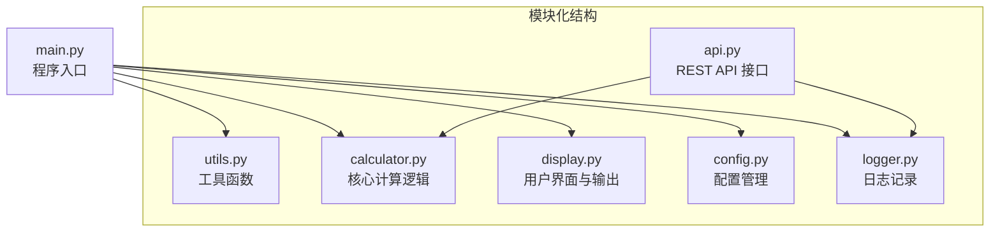
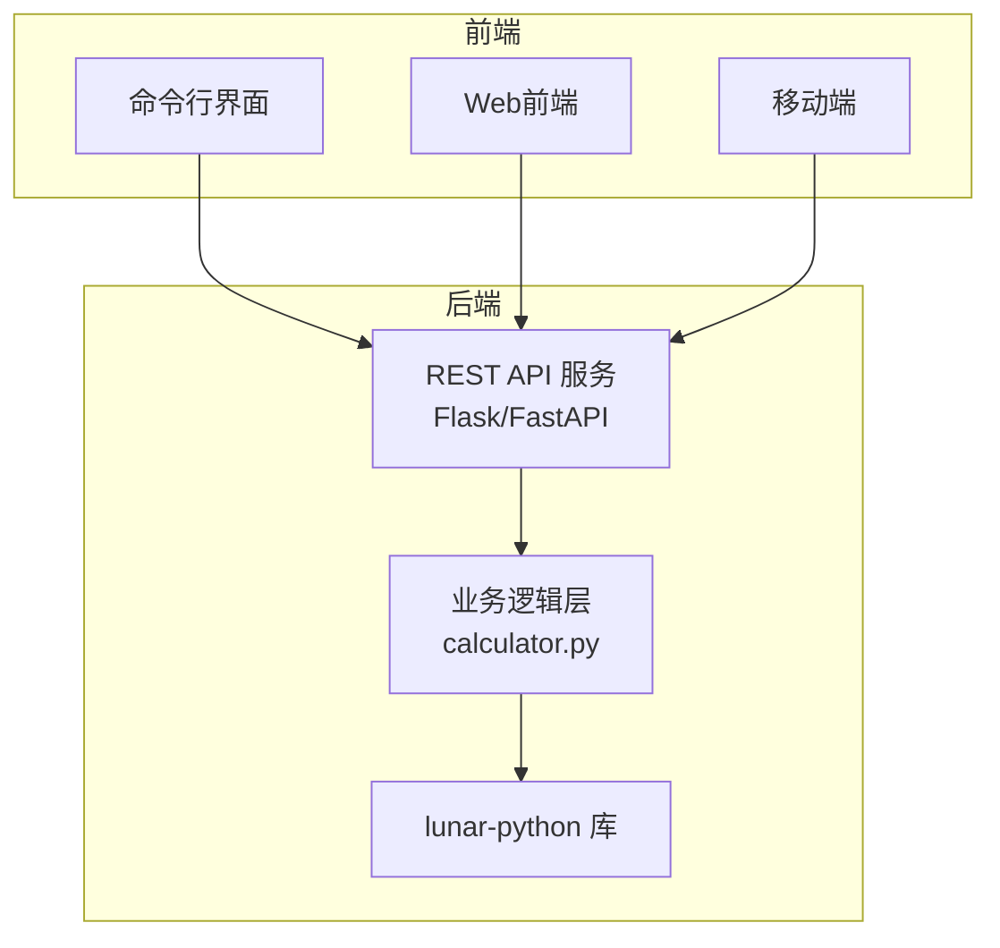
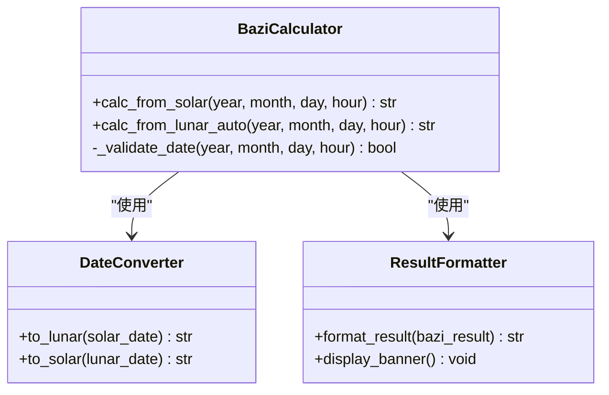
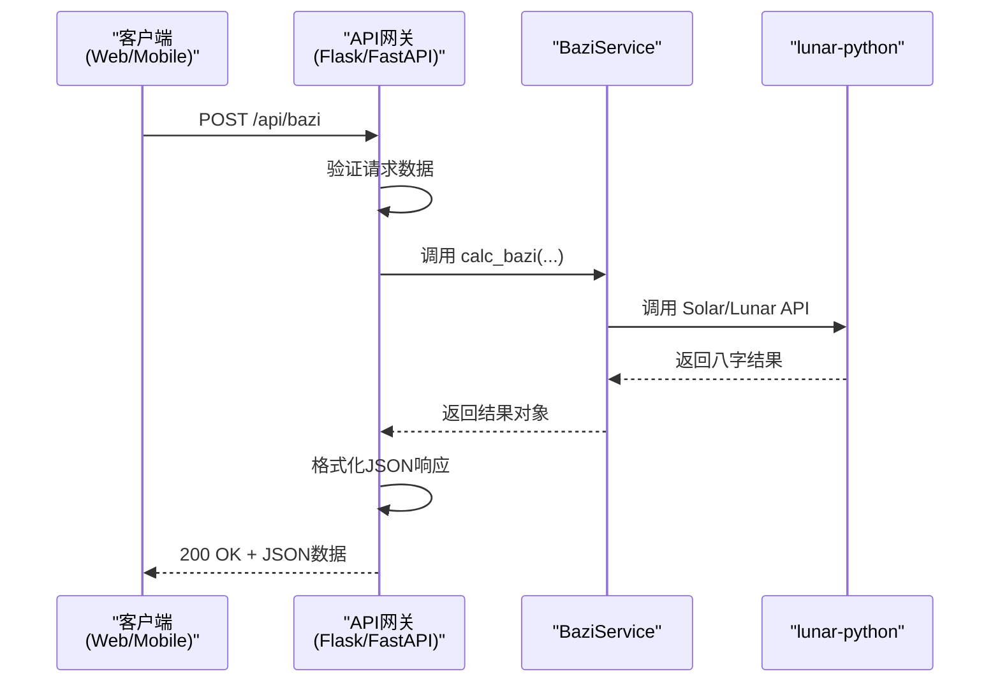
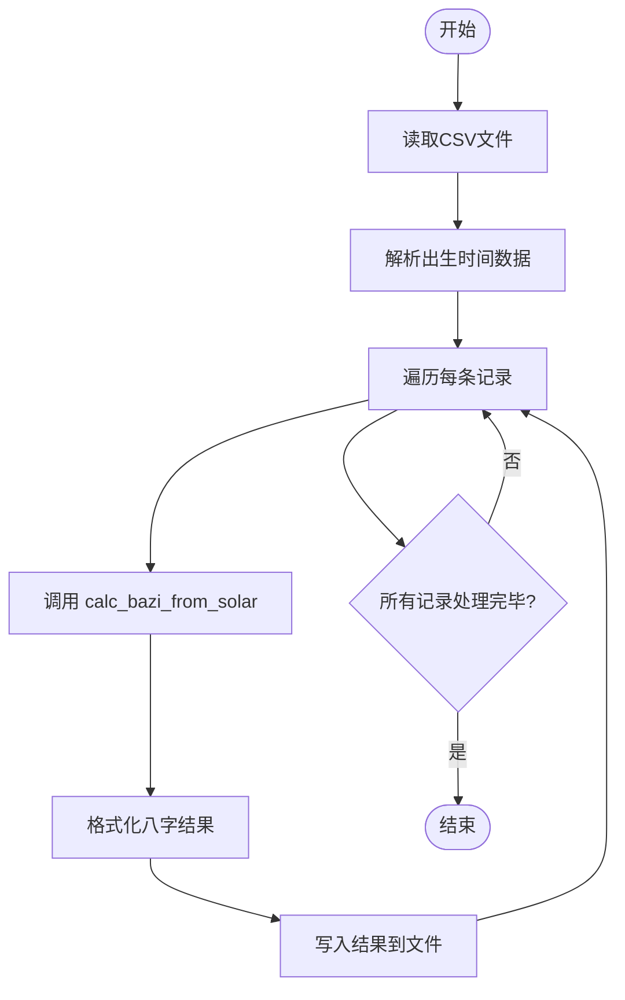
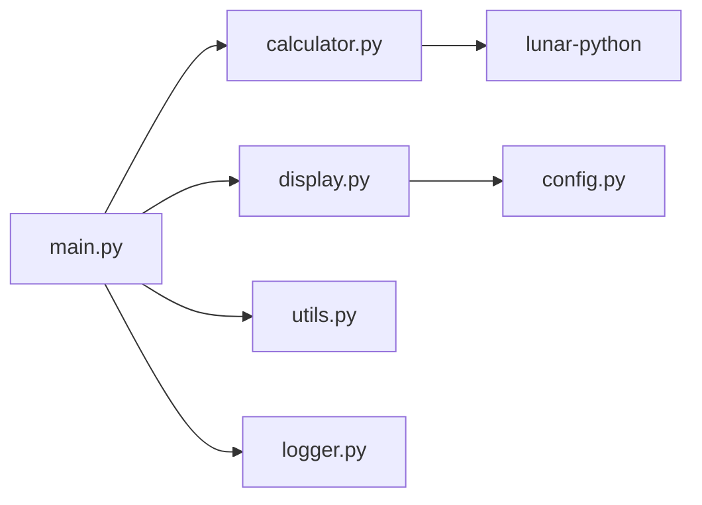

# 扩展建议

<cite>
**Referenced Files in This Document**   
- [2.py](file://2.py)
</cite>

## 目录
1. [简介](#简介)
2. [项目结构](#项目结构)
3. [核心组件](#核心组件)
4. [架构概览](#架构概览)
5. [详细组件分析](#详细组件分析)
6. [依赖分析](#依赖分析)
7. [性能考量](#性能考量)
8. [故障排除指南](#故障排除指南)
9. [结论](#结论)
10. [附录](#附录)（如有必要）

## 简介
本文档旨在为当前八字计算工具的开发者提供一系列可行的扩展方向和技术改进建议。当前项目是一个基于命令行的单文件Python脚本，利用`lunar-python`库实现公历与农历日期间的转换及四柱八字的计算功能。本文将围绕如何提升其可维护性、可扩展性和集成能力展开，提出从架构重构到功能增强的全面建议。

## 项目结构
当前项目采用单文件结构，所有功能均集中于`2.py`文件中。这种结构在项目初期便于快速开发和部署，但随着功能复杂度的增加，会显著降低代码的可读性、可维护性和可测试性。建议将现有功能模块化，拆分为多个职责清晰的Python模块。

**Diagram sources**
- [2.py](file://2.py#L1-L515)

**Section sources**
- [2.py](file://2.py#L1-L515)

## 核心组件
该工具的核心功能围绕八字计算展开，主要包含三大组件：输入处理、核心计算和结果展示。输入处理组件负责获取用户输入的公历或农历日期，并进行有效性验证；核心计算组件调用`lunar-python`库完成从日期到四柱八字的转换；结果展示组件则负责将计算结果以格式化的方式输出给用户。

**Section sources**
- [2.py](file://2.py#L127-L151)
- [2.py](file://2.py#L187-L231)
- [2.py](file://2.py#L474-L508)

## 架构概览
当前架构为典型的单体命令行应用，用户通过终端与程序交互。未来可扩展为分层架构，将表现层（CLI或Web API）、业务逻辑层和数据访问层（此处为外部库调用）分离。这不仅能支持多种前端（如Web、移动端），还能为未来的功能扩展（如持久化存储）奠定基础。

**Diagram sources**
- [2.py](file://2.py#L127-L151)
- [2.py](file://2.py#L187-L231)

## 详细组件分析

### 核心计算逻辑分析
核心计算逻辑由`calc_bazi_from_solar`和`calc_bazi_from_lunar_auto`等函数实现。这些函数封装了对`lunar-python`库的调用，是整个应用的业务核心。任何扩展都必须确保对这些核心函数的正确调用和异常处理。

#### 对象导向组件

**Diagram sources**
- [2.py](file://2.py#L127-L151)
- [2.py](file://2.py#L187-L231)

### API服务组件
为支持Web和移动端集成，建议将核心计算功能暴露为REST API。

#### API服务组件

**Diagram sources**
- [2.py](file://2.py#L127-L151)
- [2.py](file://2.py#L187-L231)

### 复杂逻辑组件
批量处理CSV文件的逻辑涉及文件读取、数据解析、批量计算和结果写入，是一个典型的复杂业务流程。

#### 复杂逻辑组件

**Diagram sources**
- [2.py](file://2.py#L127-L151)
- [2.py](file://2.py#L187-L231)

**Section sources**
- [2.py](file://2.py#L127-L151)
- [2.py](file://2.py#L187-L231)

## 依赖分析
当前项目的主要外部依赖是`lunar-python`库，它提供了所有农历转换和八字计算的核心能力。项目内部依赖关系简单，所有函数均在单个文件内相互调用。重构后，应明确各模块间的依赖关系，避免循环依赖。

**Diagram sources**
- [2.py](file://2.py#L1-L515)

**Section sources**
- [2.py](file://2.py#L1-L515)

## 性能考量
当前工具的性能主要受`lunar-python`库内部算法影响。对于批量处理场景，性能瓶颈可能出现在文件I/O和重复的库调用上。建议在实现批量处理时，考虑使用生成器进行流式处理，并对`lunar-python`的调用进行性能分析，必要时可引入缓存机制以避免重复计算相同日期。

## 故障排除指南
当前错误处理主要依赖`print`语句输出错误信息，这在调试和生产环境中都存在局限性。建议引入结构化日志记录，替代所有`print`语句。通过日志级别（DEBUG, INFO, ERROR）区分信息类型，并将日志输出到文件，便于问题追踪和审计。

**Section sources**
- [2.py](file://2.py#L474-L508)

## 结论
综上所述，为提升该八字计算工具的工程化水平和实用性，强烈建议进行以下改进：首先，将单文件结构重构为模块化设计，提升代码可维护性；其次，引入REST API服务，增强其集成能力；再次，增加对批量处理和配置文件的支持，提升功能性；最后，通过引入日志系统和单元测试，保障代码质量和可调试性。所有这些扩展都应以不破坏现有核心计算逻辑的稳定性和正确性为前提，确保对`lunar-python`库的调用得到妥善封装和异常处理。