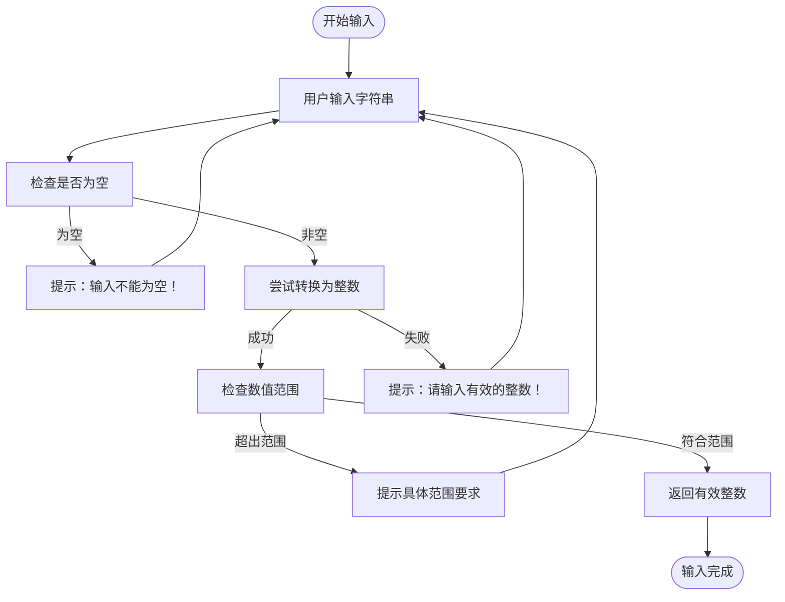
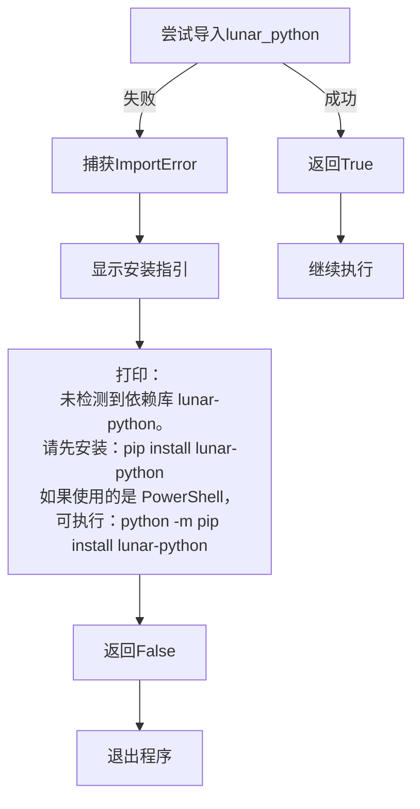
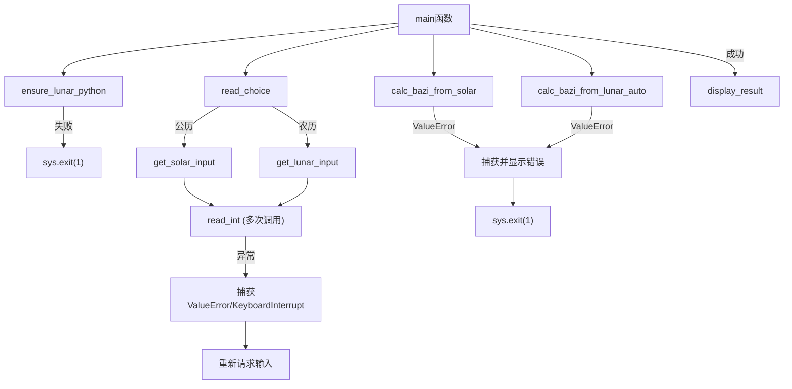

# 错误处理

<cite>
**Referenced Files in This Document**   
- [2.py](file://2.py)
</cite>

## 目录
1. [简介](#简介)
2. [核心错误处理机制](#核心错误处理机制)
3. [输入验证与范围限制](#输入验证与范围限制)
4. [依赖缺失处理](#依赖缺失处理)
5. [异常处理策略分析](#异常处理策略分析)
6. [用户使用建议](#用户使用建议)

## 简介
本程序实现了一套完整的错误处理机制，通过前置验证和局部异常捕获相结合的方式，确保四柱八字计算过程的稳定性和用户体验。程序主要通过`read_int`函数处理用户输入异常，通过`ensure_lunar_python`函数管理外部依赖，并在主流程中对计算异常进行捕获。整体设计避免了全局try-except的使用，而是采用预防性验证来减少异常发生的可能性。

## 核心错误处理机制

程序中的`read_int`函数是错误处理的核心组件，专门用于捕获和处理用户输入过程中的`ValueError`异常。当用户输入非数字字符时，该函数会捕获`ValueError`异常并提示用户重新输入，而不是让程序崩溃。

该函数通过无限循环持续请求输入，直到获得有效的整数为止。除了捕获`ValueError`外，还特别处理了`KeyboardInterrupt`异常（用户按下Ctrl+C），在这种情况下会优雅地退出程序并显示"程序已取消"的提示信息。

**Section sources**
- [2.py](file://2.py#L32-L67)

## 输入验证与范围限制

程序实现了严格的输入验证逻辑，通过前置条件检查来防止非法数据进入计算流程。`read_int`函数不仅验证输入是否为有效整数，还通过`min_value`和`max_value`参数限制数值的合理范围。

具体范围限制包括：
- 年份：1-9999年
- 月份：1-12月
- 日期：1-31日（公历）或1-30日（农历）
- 小时：0-23时

当输入值超出合理范围时，函数会给出具体的错误提示，如"数值需不小于 {min_value}"或"数值需不大于 {max_value}"，引导用户输入正确的数值。这种前置验证机制有效减少了后续计算过程中可能出现的异常。

**Diagram sources**
- [2.py](file://2.py#L32-L67)

**Section sources**
- [2.py](file://2.py#L32-L67)

## 依赖缺失处理

程序通过`ensure_lunar_python`函数专门处理外部依赖缺失的问题。当lunar-python库未安装时，该函数会捕获`ImportError`异常，并向用户显示清晰的安装指引。

错误提示信息包含具体的安装命令：
- 基础安装命令：`pip install lunar-python`
- PowerShell环境下的安装命令：`python -m pip install lunar-python`

这种处理方式确保了用户能够明确知道如何解决问题，而不是面对一个模糊的导入错误。函数返回布尔值，主程序根据返回结果决定是否继续执行，实现了依赖检查与主流程的解耦。

**Diagram sources**
- [2.py](file://2.py#L12-L29)

**Section sources**
- [2.py](file://2.py#L12-L29)

## 异常处理策略分析

程序采用了"预防优于治疗"的异常处理策略，主要特点包括：

1. **局部异常捕获**：在`read_int`和`ensure_lunar_python`等具体功能函数中捕获特定异常，而不是在顶层使用全局try-except。
2. **前置验证**：通过输入验证减少异常发生的机会，如检查空输入、数值范围等。
3. **用户友好提示**：所有错误信息都以中文清晰表述，并提供解决方案。
4. **优雅退出**：对`KeyboardInterrupt`进行专门处理，避免显示堆栈跟踪。

在主函数中，程序对`calc_bazi_from_solar`和`calc_bazi_from_lunar_auto`的调用也使用了try-except结构来捕获`ValueError`，这些异常通常由无效的日期组合引起。这种分层的异常处理机制既保证了程序的健壮性，又提供了良好的用户体验。

**Diagram sources**
- [2.py](file://2.py#L439-L473)

**Section sources**
- [2.py](file://2.py#L439-L473)

## 用户使用建议

为确保程序正常运行，建议用户注意以下事项：

1. **依赖安装**：在首次使用前确保已安装lunar-python库，保持网络通畅以便顺利下载依赖。
2. **输入格式**：严格按照提示输入数字，避免输入字母或其他非数字字符。
3. **数值范围**：注意各输入项的合理范围，如月份应在1-12之间，日期应在1-31之间。
4. **中断处理**：如需退出程序，可使用Ctrl+C组合键，程序会优雅地终止。
5. **错误响应**：当出现错误提示时，仔细阅读提示信息并按要求重新输入。

通过遵循这些使用建议，用户可以最大限度地避免错误发生，顺利完成四柱八字的计算。程序的设计充分考虑了用户的实际使用场景，力求在功能性和易用性之间取得平衡。