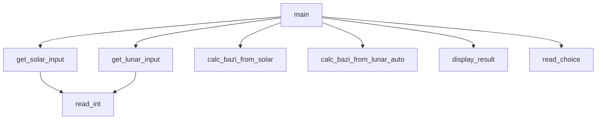

# 项目概述

<cite>
**Referenced Files in This Document**   
- [2.py](file://2.py)
</cite>

## 目录
1. [项目概述](#项目概述)
2. [核心功能与设计目标](#核心功能与设计目标)
3. [架构特点与代码结构](#架构特点与代码结构)
4. [关键依赖与外部库](#关键依赖与外部库)
5. [背景知识引导](#背景知识引导)
6. [使用场景示例](#使用场景示例)
7. [可扩展性与集成潜力](#可扩展性与集成潜力)

## 核心功能与设计目标

四柱八字计算器项目旨在为用户提供一个基于公历或农历出生时间的八字（年柱、月柱、日柱、时柱）计算服务。该项目作为一个命令行工具，允许用户通过简单的交互式输入来获取精确的八字信息。其主要设计目标是实现自动化计算，减少传统命理学中手动推算的复杂性和错误率。

该工具支持两种输入模式：公历和农历。用户可以选择输入公历日期，系统将自动转换为对应的农历日期并计算出四柱八字；或者直接输入农历日期，系统会验证其有效性并进行相应的计算。这种灵活性使得工具适用于不同用户的习惯和需求。

在传统命理学中，四柱八字被广泛应用于个人命运分析、婚姻匹配、职业选择等方面。通过本项目，用户可以快速获得准确的八字信息，从而为进一步的命理分析提供可靠的数据基础。此外，项目还注重用户体验，提供了清晰的提示信息和错误处理机制，确保用户能够顺利地完成整个计算过程。

**Section sources**
- [2.py](file://2.py#L439-L473)
- [2.py](file://2.py#L99-L123)
- [2.py](file://2.py#L126-L156)

## 架构特点与代码结构

本项目采用过程式编程和模块化函数设计的架构特点，所有逻辑集中于单个文件中，便于维护和理解。代码结构清晰，每个函数都有明确的职责和功能，遵循高内聚低耦合的原则。

主函数 `main()` 是程序的入口点，负责协调各个子功能模块的调用。它首先显示程序标题和说明，然后检查并确保 `lunar-python` 库已安装。接着，根据用户的选择，分别调用 `get_solar_input()` 或 `get_lunar_input()` 函数来获取输入数据。之后，使用 `calc_bazi_from_solar()` 或 `calc_bazi_from_lunar_auto()` 函数进行八字计算，并最终调用 `display_result()` 函数展示结果。

为了提高代码的可读性和可维护性，项目中的函数都具有详细的文档字符串，描述了参数、返回值以及可能抛出的异常。例如，`calc_bazi_from_solar()` 函数接受公历年、月、日、时作为输入，返回四柱八字的字符串元组；而 `calc_bazi_from_lunar()` 函数则额外需要一个布尔值参数来指示是否为闰月。

此外，项目还实现了输入验证机制，通过 `read_int()` 和 `read_choice()` 函数确保用户输入的有效性。这些辅助函数不仅提高了代码的复用性，也增强了程序的健壮性。

**Diagram sources**
- [2.py](file://2.py#L439-L473)
- [2.py](file://2.py#L99-L123)
- [2.py](file://2.py#L126-L156)
- [2.py](file://2.py#L159-L203)

**Section sources**
- [2.py](file://2.py#L439-L473)
- [2.py](file://2.py#L99-L123)
- [2.py](file://2.py#L126-L156)
- [2.py](file://2.py#L159-L203)

## 关键依赖与外部库

项目的关键依赖是 `lunar-python` 库，它在农历转换和天干地支计算中起着至关重要的作用。`lunar-python` 是一个专门用于处理农历和干支纪年的 Python 库，提供了丰富的 API 来进行日期转换和相关计算。

在项目中，`ensure_lunar_python()` 函数负责检查并确保 `lunar-python` 库已正确安装。如果未检测到该库，程序会提示用户安装，并给出具体的安装命令。这保证了程序运行环境的完整性，避免因缺少依赖而导致的运行时错误。

`lunar-python` 库的具体应用体现在以下几个方面：
- `Solar.fromYmdHms()` 方法用于从公历日期创建 `Solar` 对象。
- `Lunar.fromYmdHms()` 方法用于从农历日期创建 `Lunar` 对象。
- `getLunar()` 和 `getSolar()` 方法分别用于在公历和农历之间进行转换。
- `getEightChar()` 方法用于获取四柱八字信息。

通过利用 `lunar-python` 库的强大功能，项目能够高效且准确地完成复杂的农历和干支计算，为用户提供可靠的八字结果。

**Section sources**
- [2.py](file://2.py#L12-L29)

## 背景知识引导

### 天干地支系统
天干地支是中国古代用来记录年、月、日、时的一种方法。天干有十个：甲、乙、丙、丁、戊、己、庚、辛、壬、癸；地支有十二个：子、丑、寅、卯、辰、巳、午、未、申、酉、戌、亥。两者组合形成六十甲子循环，每六十年为一个周期。

### 农历闰月机制
农历是一种阴阳合历，为了协调回归年与朔望月之间的差异，设置了闰月。通常每两三年增加一个闰月，使得农历年的平均长度接近回归年。闰月的设置遵循一定的规则，如“十九年七闰”法。

### 四柱含义
四柱即年柱、月柱、日柱、时柱，每一柱由一个天干和一个地支组成。它们共同构成了一个人出生时刻的八字，被认为是影响个人命运的重要因素。年柱代表祖上和早年运势，月柱代表父母和青年运势，日柱代表自身和中年运势，时柱代表子女和晚年运势。

## 使用场景示例

以下是一个简明的使用场景示例，展示从启动程序到输出结果的完整流程：

1. 启动程序后，屏幕上显示标题和说明信息。
2. 用户选择输入历法，输入 `g` 表示公历，`n` 表示农历。
3. 若选择公历，用户依次输入年、月、日、时。例如，输入 `2023`、`10`、`1`、`15`，表示 2023 年 10 月 1 日 15:00。
4. 程序验证输入的有效性，调用 `calc_bazi_from_solar()` 函数进行计算。
5. 计算完成后，程序调用 `display_result()` 函数展示结果，包括公历时间、农历时间以及四柱八字信息。
6. 若选择农历，用户同样输入年、月、日、时。程序会自动判断是否为闰月，并进行相应的计算。
7. 最终结果显示在屏幕上，用户可以查看并记录所需信息。

此流程简洁明了，即使是初学者也能轻松上手。

**Section sources**
- [2.py](file://2.py#L439-L473)
- [2.py](file://2.py#L99-L123)
- [2.py](file://2.py#L126-L156)

## 可扩展性与集成潜力

尽管项目目前的所有逻辑集中于单个文件中，但其模块化的设计为未来的扩展和集成提供了良好的基础。以下是几个潜在的扩展方向：

1. **图形用户界面（GUI）**：可以通过添加 GUI 框架（如 Tkinter 或 PyQt）来提升用户体验，使操作更加直观。
2. **Web 服务**：将核心计算逻辑封装为 RESTful API，允许其他应用程序通过 HTTP 请求调用服务。
3. **数据库支持**：引入数据库存储用户的历史查询记录，便于后续分析和管理。
4. **多语言支持**：增加国际化支持，使工具能够服务于更多地区的用户。
5. **高级命理分析**：基于八字结果，进一步开发流年运势、五行平衡等高级分析功能。

此外，项目还可以与其他命理学工具或平台集成，形成更完整的解决方案。例如，与风水罗盘软件结合，提供全方位的命理咨询服务。

**Section sources**
- [2.py](file://2.py#L439-L473)